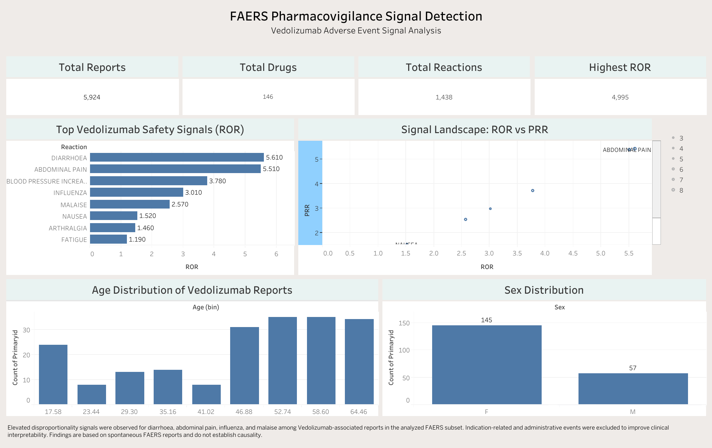

# FAERS Pharmacovigilance Signal Detection Analysis

## Vedolizumab Adverse Event Signal Assessment using FDA FAERS Data (2025 Q1)

This project explores adverse event reporting patterns associated with **Vedolizumab** using the **FDA Adverse Event Reporting System (FAERS)**. The objective was to identify potential pharmacovigilance safety signals through **disproportionality analysis**, including **Reporting Odds Ratio (ROR)** and **Proportional Reporting Ratio (PRR)** calculations.

The workflow involved **SQL-based cleaning, deduplication, signal detection, and Tableau visualization** to build an end-to-end healthcare analytics case study.

---

## Project Objective

This project aimed to:

- Clean and preprocess FAERS adverse event data
- Remove duplicate drug and reaction records
- Build an integrated SQL-based master dataset
- Detect disproportional safety signals
- Calculate **ROR** and **PRR**
- Visualize pharmacovigilance insights using Tableau
- Demonstrate healthcare data analytics skills in a reproducible workflow

---

## Dataset Information

**Source:** FDA Adverse Event Reporting System (FAERS)

**Quarter Analyzed:** 2025 Q1

### Datasets Used

- `DEMO` → Patient demographics
- `DRUG` → Drug information
- `REAC` → Adverse reactions

---

## Dataset Summary

| Metric | Value |
|--------|------:|
| Total Reports | 5924 |
| Total Drugs | 146 |
| Total Reactions | 1438 |
| Maximum Dataset ROR | 4995 |

> Note: The Maximum Dataset ROR reflects the strongest disproportionality signal observed in the complete cleaned analytical dataset and is not specific to Vedolizumab-associated reactions.

---

## Methodology

The analysis followed the workflow below:

```text
FAERS Data Import
        ↓
Data Cleaning
        ↓
Deduplication
        ↓
SQL Dataset Integration
        ↓
Signal Detection
        ↓
ROR + PRR Calculation
        ↓
Tableau Dashboard
```

### Data Cleaning Steps

- Retained **Primary Suspect (PS)** drugs only
- Removed duplicate drug–reaction reports
- Excluded:
  - Missing age
  - Age = 0
  - Missing sex information
- Removed indication and administrative noise such as:
  - Crohn’s disease
  - Off label use
  - Product use issue
  - Product dose omission issue

---

## Key Safety Signals Identified for Vedolizumab

Following signal cleaning and filtering, elevated disproportionality signals included:

- Diarrhoea
- Abdominal Pain
- Blood Pressure Increased
- Influenza
- Malaise
- Arthralgia
- Fatigue

These findings represent **signal detection observations** and do **not establish causality**.

---

## Tools & Technologies

- SQL (SQLite)
- Excel
- Tableau Public
- GitHub

---

## Dataset Preview

### master_final.csv

| primaryid | drugname_clean | reaction_clean | age | sex |
|------------|----------------|----------------|-----|-----|
| 1402638713 | VEDOLIZUMAB | Heart rate decreased | 51 | F |
| 1425006113 | VEDOLIZUMAB | Chills | 48 | M |
| 1435354018 | VEDOLIZUMAB | Platelet count increased | 32 | F |

---

### signal_summary_clean.csv

| drug | reaction | a | ROR | PRR |
|------|----------|---:|----:|----:|
| VEDOLIZUMAB | DIARRHOEA | 8 | 6.70 | 6.47 |
| VEDOLIZUMAB | ABDOMINAL PAIN | 5 | 6.58 | 6.44 |
| VEDOLIZUMAB | BLOOD PRESSURE INCREASED | 5 | 4.51 | 4.43 |

---

## Project Files

```text
data/
├── signal_summary_clean.csv
└── master_final.csv

sql/
└── analysis.sql

dashboard/
├── tableau_dashboard.png
└── tableau_public_link.txt

report/
└── final_report.pdf

images/
├── top_signals_chart.png
├── signal_landscape.png
└── dashboard_preview.png
```
## SQL Workflow

📜 [View SQL Analysis](data/data/sql/sql/dashboard/analysis.sql)
---

## Dashboard Preview



---

## Tableau Dashboard

Add your Tableau Public link below:

[View Interactive Dashboard](https://public.tableau.com/views/faers-pharmacovigilance-signal-detection/FAERSPharmacovigilanceSignalDetection?:language=en-US&:sid=&:redirect=auth&:display_count=n&:origin=viz_share_link)

---

## Report

📄 [View Full Project Report](report/final_report.pdf)
---
## Key Disclaimer

FAERS is a spontaneous reporting database and may contain underreporting, duplicate reporting, and reporting bias. The analysis identifies potential safety signals and reporting patterns rather than causal relationships.

---

## Author

**Amna Sheraz**  
